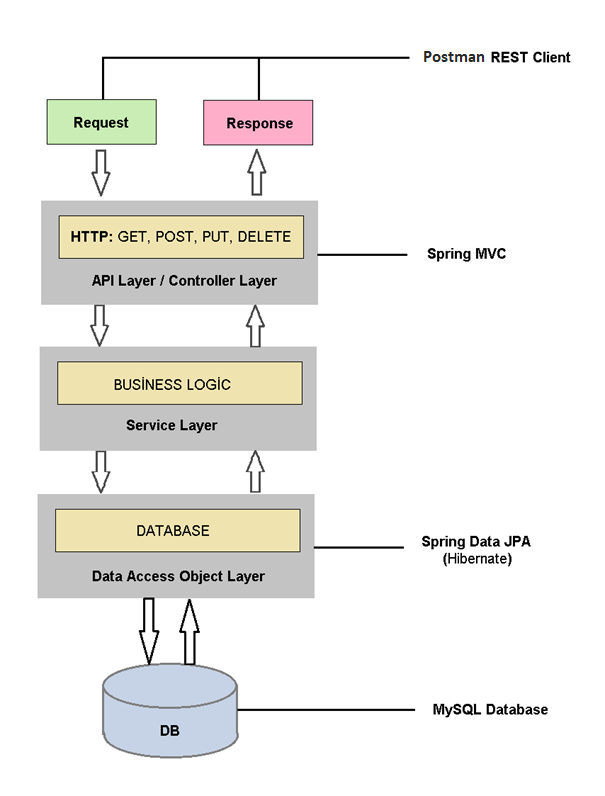
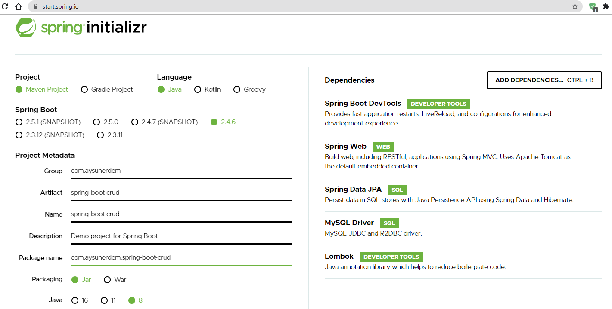
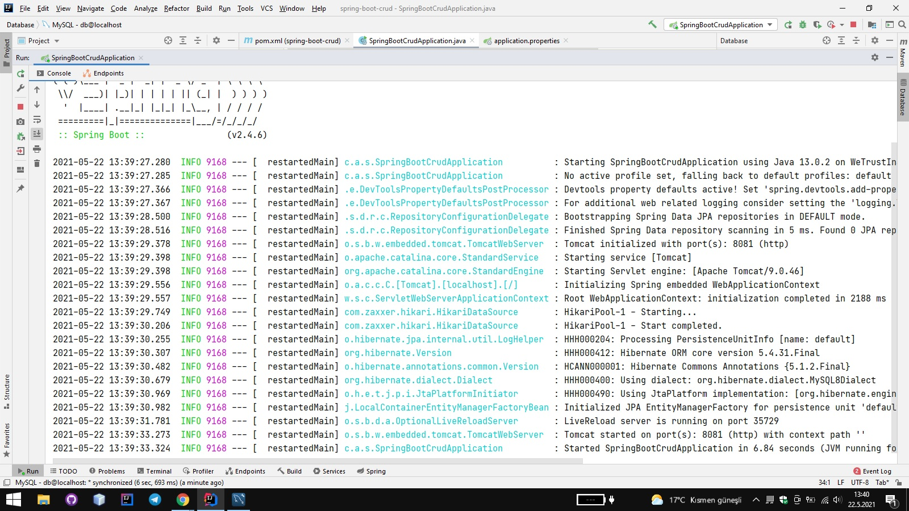
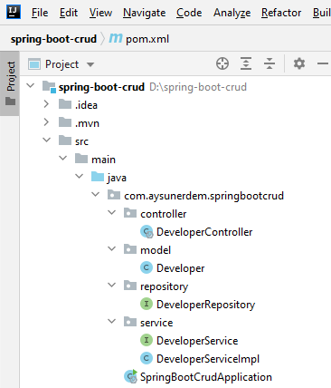
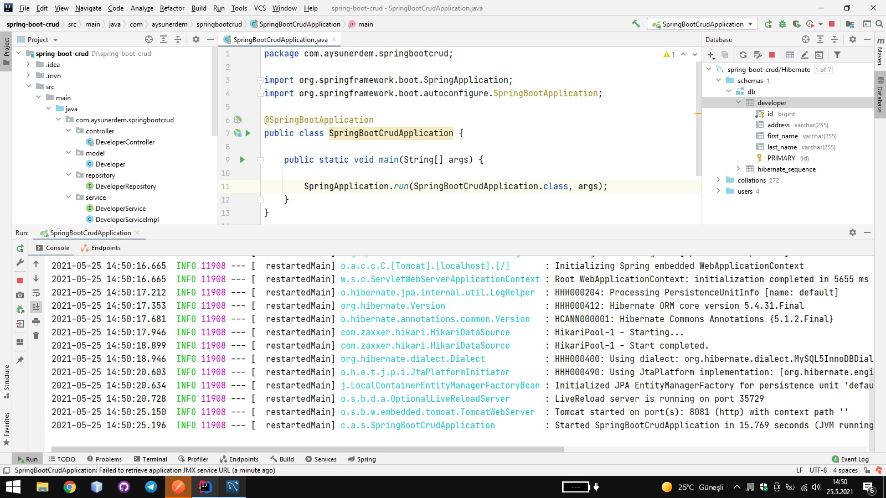
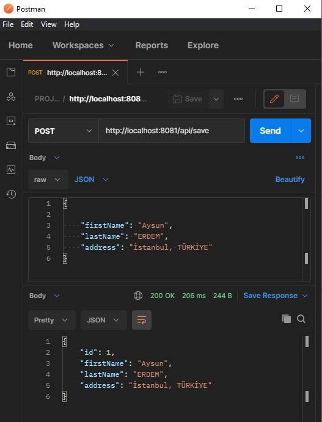
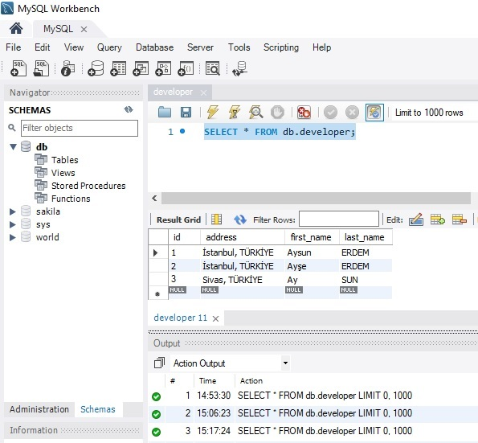
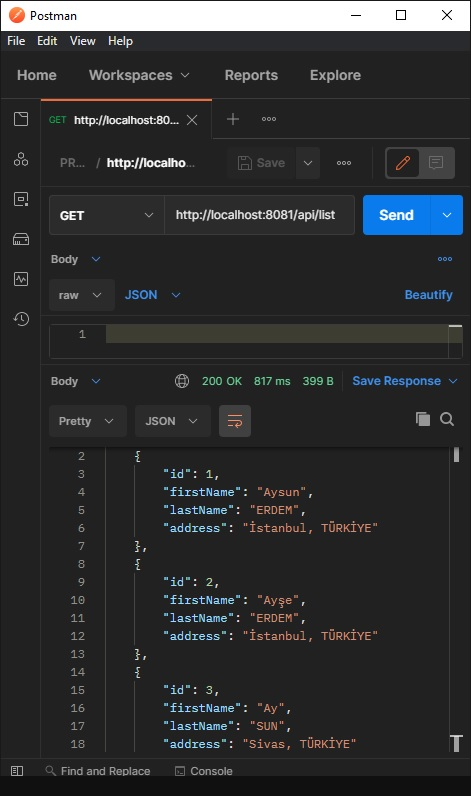
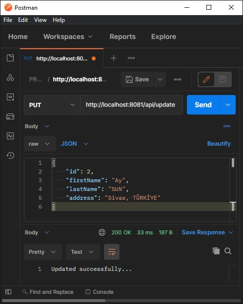
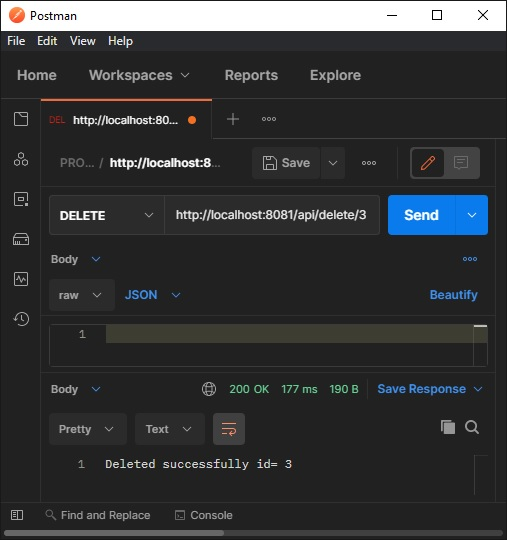

# Spring Boot CRUD Operations

 

**PROJE TANITIM**

•	Bu projede Java 8 ile Spring Boot kullanılarak crud işlemleri gerçekleştirilmiştir. 

•	Crud işlemleri Create, Read, Update ve Delete olmak üzere 4 aşamadan meydana gelmektedir. 

•	Bu işlemler REST API 'ler aracılığı ile yerine getirilmiştir. 

•	Proje genelinde OOP prensiplerine uyulmuştur. 

•	API 'ler Postman arayüzü ile test edilmiştir.

**KULLANILAN TEKNOLOJİLER**

•	Spring Boot
•	Spring Framework
•	Spring Data JPA
•	Hibernate
•	Maven
•	Lombok
•	Postman
•	IntelliJ IDEA
•	MySQL

**PROJE TASARIMI**

 
**KULLANILAN FONKSİYONLAR**

...

**PROJE DOSYASININ OLUŞTURULMASI**

 

Yukarıdaki resimde görüldüğü üzere proje taslağı https://spring.io/ web sitesi üzerinden oluşturulmuştur. Proje için gerekli bilgiler ve bağımlılıklar belirlenmiştir. Daha sonrasında Generate butonu aracılığı ile proje bilgisayara indirilip Intellij IDEA içerisinde açılmıştır.

**VERİTABANI BAĞLANTISI VE MYSQL DRIVER EKLENMESİ**

 

Drivers kısmından MySQL Driver kuruldu. Data Sources kısmında ise daha öncesinde kurulu olan veritabanı şemasının name, user ve password u doldurularak bağlantı test edildi. Ama daha öncesinde resource klasöründe aplication.properties dosyası içerisine server port bilgisi ve veritabanının url, username, password bilgileri yazıldı. Aynı zamanda ORM aracı tercih edildiği için Hibernate özelliği bu kısımda eklendi.
 

Uygulama dosyası boş haliyle çalıştırılmış ve internet üzerinden localhost:8081 adresine giderek uygulamanın ayağa kalkıp kalkmadığı kontrol edilmiştir.

 

**PROJE PAKET YAPISI**

 
 
 

Kodlama işlemi tamamlandıktan sonra proje ayağa kaldırılıp Postman üzerinden test aşamaşına geçildi ve status kodlarla birlikte veritabanı üzerinden işlemler kontrol edildi.

**POSTMAN TEST**

**REST API Oluşturma**

HTTP Method: POST 
 

Developer oluşturmak için Postman aracılığı ile JSON tipinde request atılarak veritabanına 3 farklı kayıt atıldı. 

**REST API Listeleme**

HTTP Method: GET

 

**REST API Güncelleme**

HTTP Method: PUT

 

**REST API Silme**

HTTP Method: DELETE

 

